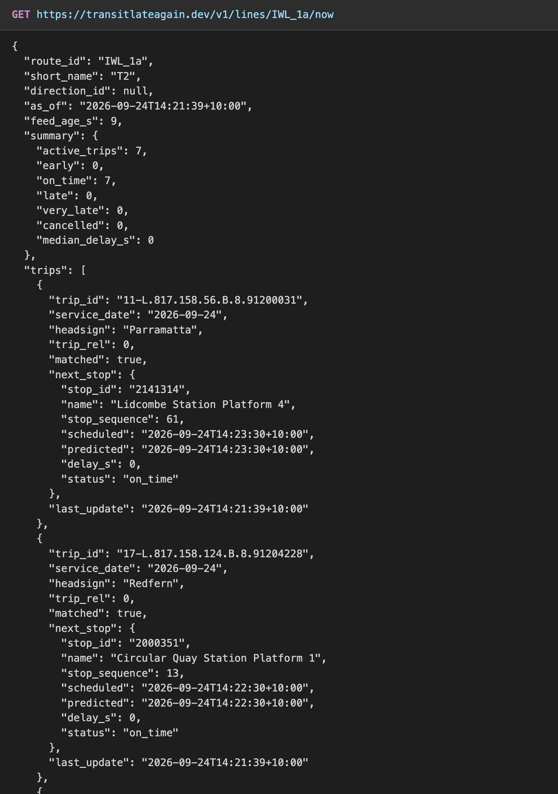
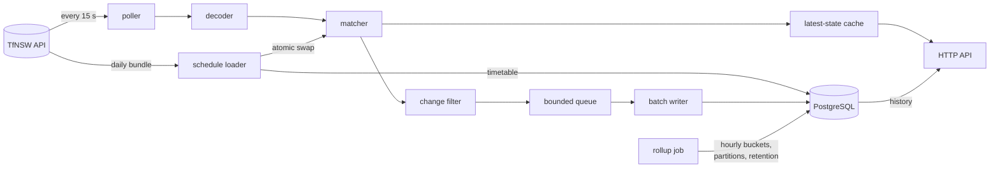

# Transit Late Again

On-time performance for the Sydney transport network. Transit Late Again polls the
Transport for NSW GTFS-realtime feeds, matches every stop-time update against
the published timetable, and stores the delay it observes, so it can answer two
questions: what is happening on this line right now, and how has this stop or
line performed over the last N days.

TfNSW publishes realtime data and timetable data but not on-time performance,
and the realtime feed is not archived anywhere queryable. Transit Late Again captures it.

`PROJECT.md` is the design document and the source of truth for this repository.

## Status

Stages 1–2 are complete and Stage 3 is nearly so (`PROJECT.md` §12). Five
feeds — Sydney Trains, Metro, Sydney Ferries and both light rail lines — are
polled every 15 s, matched against their daily timetables, stored, rolled up
hourly and served. Buses are left off: they would not fit the 1 GB VM
(`docs/quota.md`).

**Live since 2026-09-24** on a BinaryLane VM in Sydney
(`deploy/vm-bootstrap.md`):
[`transitlateagain.dev/v1/lines/IWL_1a/now`](https://transitlateagain.dev/v1/lines/IWL_1a/now)
is what the T2 is doing right now. Cloudflare sits in front; metrics go to
Grafana Cloud.



## How it works



One Go process, one Postgres, one VM. Each box is a package with one job
(`PROJECT.md` §4.2): the decoder knows nothing about the timetable, the matcher
nothing about SQL, and the API never writes. The queue drops rather than blocks,
so a slow database can never stall a poller. Observations are partitioned by
service day and dropped after `RETENTION_DAYS`; the hourly rollups are kept.

The hard parts, each written up in `PROJECT.md` §9:

- **Service days and daylight saving.** GTFS times such as `25:10:00` are
  offsets from noon minus twelve hours on the service date, which is 23:00 the
  night before on the October change and 01:00 on the April one. Both
  transitions are hard-coded test fixtures.
- **Matching.** The feed never sends `stop_sequence` or `start_date`, so a
  trip is placed on its service date by its calendar and how close its
  scheduled time is to the update.
- **Idempotence.** Every row is keyed on the feed's own timestamp, so replaying
  a response writes nothing new.

## Numbers

Measured, with dates, not estimated (`PROJECT.md` §13):

| | |
|---|---|
| Match rate | Trains **99.6–99.7 %**; Metro, Ferries, Parramatta light rail **100 %**; CBD light rail 89.7 %, every miss a cancellation of a trip variant missing from its bundle (2026-09-23, live; `ADDED` excluded) |
| API latency at 50 RPS | `/now` p95 **1.4 ms**; 30-day history p95 **24 ms** (stop) and 21 ms (route); 15,000 of 15,000 requests OK per run (`docs/loadtest.md`) |
| Updates per poll | 2,859–3,939 across the polls measured (2026-09-21 and 23, evening and off-peak) |
| Change filter | 100 % of updates identical across two polls 15 s apart (2026-09-21) |
| Raw storage | 276.9 bytes per row (2026-09-21) |
| Timetable load | 11.3 MB zip → 68,738 trips, 1,244,526 stop times in 19.9 s, peak 54 MB RSS |
| Service memory | 196 MB RSS with all five timetables loaded; 141 MiB for trains alone under Compose, beside Postgres at 300 MiB |
| Rollup | 878 stop visits into hourly buckets in 145 ms |
| Container image | 23.9 MB, distroless, non-root |
| Tests | 367 tests and subtests (319 without a database), 80.2 % statement coverage |

Still to measure: a full day's storage, peak-hour volume and uptime — all of
which need the VM (`docs/storage.md`).

## API

```sh
curl localhost:8080/v1/lines                                   # every route in the timetable
curl localhost:8080/v1/lines/APS_1a/now                        # what the T8 is doing now
curl localhost:8080/v1/stops/2020102/now?window_min=30         # departures from a stop
curl "localhost:8080/v1/lines/APS_1a/history?from=2026-09-20&bucket=day"
curl localhost:8080/readyz
```

Swap `localhost:8080` for `https://transitlateagain.dev` to ask the live
service. It allows 10 requests a second per client. `/v1/admin/stats` is not on the
public port; it listens on `ADMIN_ADDR`, which the VM keeps on loopback.

Route and stop ids are TfNSW's own (`APS_1a` is one T8 pattern; `2020102` is
International Station, Platform 2). `PROJECT.md` §7 is the contract, including
every error code.

## Running it

```sh
cp .env.example .env     # then put a real TFNSW_API_KEY in it

docker run -d --name headway-dev-pg -p 5432:5432 \
  -e POSTGRES_USER=headway -e POSTGRES_PASSWORD=headway -e POSTGRES_DB=headway \
  postgres:18-alpine

make migrate             # apply migrations; the service also does this on start
make run                 # poll, match, store, serve on :8080
```

`make test` runs the unit tests; `make test-integration` also runs the ones
needing a database, and skips them when `DATABASE_URL_TEST` is unset. Both URLs
in `.env.example` already point at the container above. `make lint` is gofmt,
go vet and staticcheck, exactly as CI runs them.

To run the whole thing as it is deployed — Postgres and the service in Compose,
built from `deploy/Dockerfile` — set `POSTGRES_PASSWORD` in `.env` and:

```sh
make up                  # build, start, migrate; the API is on :8080
curl localhost:8080/readyz
make down                # the database volume survives
```

Every configuration variable is documented in `.env.example` and in
`PROJECT.md` §8.

## Stack

Go 1.27, PostgreSQL 18, pgx v5, the standard library's `ServeMux` and
`log/slog`. Three direct dependencies. `PROJECT.md` §3 says what each was chosen
over and why.
